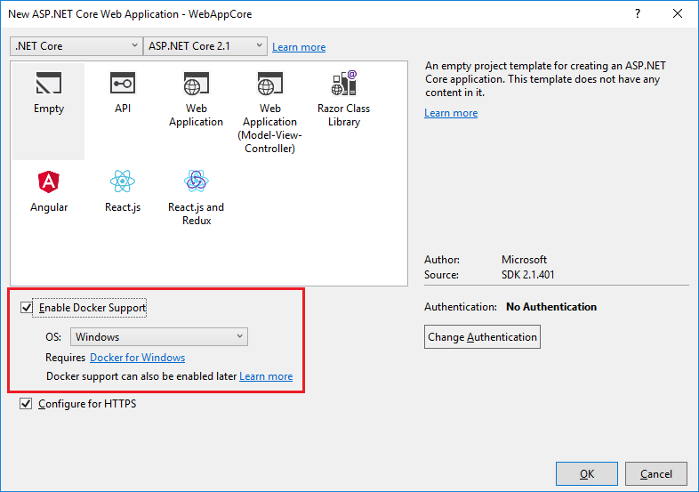

# Use Visual Studio Tools for Docker (Visual Studio on Windows)

The Visual Studio Tools for Docker developer workflow is similar to using Visual Studio Code and Docker CLI (it is based on the same Docker CLI). Visual Studio Tools for Docker makes it even easier to get started, simplifies the process, and provides greater productivity for the build, run, and compose tasks. Execute and debug your containers via simple actions like **F5** and **Ctrl**+**F5**. You can also run and debug a group of containers (a whole solution) at the same time if they're defined in the same *docker-compose.yml* file at the solution level.

## Configure your local environment

With the latest versions of Docker for Windows ([https://docs.docker.com/docker-for-windows/](https://docs.docker.com/docker-for-windows/)), the straightforward setup makes it easy to develop Docker applications.

Docker support is included in Visual Studio 2017. Download Visual Studio 2017 here: [https://aka.ms/vsdownload?utm_source=mscom&utm_campaign=msdocs](https://aka.ms/vsdownload?utm_source=mscom&utm_campaign=msdocs)

## Use Docker Tools in Visual Studio 2017

When you add Docker support to a web app project, Visual Studio adds a DockerFile file to the project. When you add container orchestrator support, Visual Studio not only adds a DockerFile to the project, but also a global docker-compose.yml file at the solution level. If *docker-compose.yml* already exists, Visual Studio adds the required lines of configuration code to it. It's an easy way to begin composing your multicontainer solution. You can then open the *docker-compose.yml* file and update it with additional features.

The **Add** > **Docker Support** and **Add** > **Container Orchestrator Support** commands are located on the right-click menu (or context menu) of the project node for an ASP.NET Core web app project in **Solution Explorer**:

> [!NOTE]
> The **Add** > **Container Orchestrator Support** menu item is available in Visual Studio 2017 version 15.8 and later. In prior versions of Visual Studio, adding Docker support to a project also added a docker-compose.yml file to the solution.

After you add container orchestration support to your project, you see the following new files in **Solution Explorer**:

You can also enable Docker support when you create an ASP.NET Core project in Visual Studio 2017 by selecting **Enable Docker Support** in the **New ASP.NET Core Web Application** dialog box. Enabling Docker support adds a Dockerfile, but not a docker-compose.yml file.

>[!div class="step-by-step"]
[Previous](docker-apps-inner-loop-workflow.md)
[Next](set-up-windows-containers-with-powershell.md)

## See also

- [Visual Studio Tools for Docker with ASP.NET Core](/aspnet/core/host-and-deploy/docker/visual-studio-tools-for-docker)
- [Deploy an ASP.NET container to a container registry using Visual Studio](/azure/vs-azure-tools-docker-hosting-web-apps-in-docker)
- [Debugging apps in a local Docker container](/azure/vs-azure-tools-docker-edit-and-refresh)